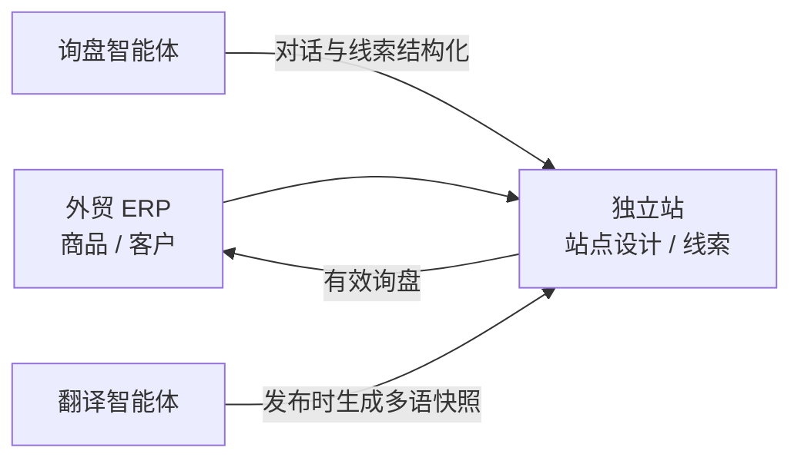
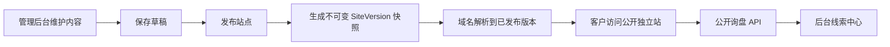

# Mercivo 业务与系统架构

## 产品定位

Mercivo 是面向外贸企业的「商品与客户管理 + 独立站获客 + AI 智能体」最小可上线系统。管理后台只提供中文界面；多语言是独立站的发布能力，不是后台的界面语言能力。

## 业务模块

| 一级模块 | 二级能力 | MVP 边界 |
| --- | --- | --- |
| 外贸 ERP | 商品管理、客户管理 | 商品基础信息、分类、规格、价格、库存和发布状态；客户档案、分级与备注。不做订单、采购、财务、仓储流程。 |
| 独立站 | 站点设计、客户线索 | 使用预设区块完成首页/商品列表/商品详情/询盘表单的简易编排、预览、发布和回滚；线索收集、分配、跟进和转客户。 |
| 智能体中心 | 询盘智能体、翻译智能体 | 系统只预置这两种用途。询盘智能体负责访客接待和线索结构化；翻译智能体负责独立站多语言内容生成。 |

商机管理、开发信、邮件营销、产品推荐智能体和线索培育智能体不属于当前 MVP。

## 信息架构

```text
工作台
外贸 ERP
├─ 商品管理
└─ 客户管理
独立站
├─ 站点设计
└─ 客户线索
AI赋能
└─ 智能体中心（预置询盘智能体、翻译智能体）
系统管理
├─ 账号设置
└─ 字典管理
```

## 独立站 MVP 设计

- 站点设计采用「预设模板 + 区块配置」，不做自由画布、任意拖拽、代码编辑或插件市场。
- 首期区块仅包含导航、首屏、企业介绍、商品列表、询盘表单、询盘智能体和页脚。
- 站点内容以中文为源语言；启用第二语言时必须绑定已启用的翻译智能体。
- 翻译在发布阶段生成，以 `siteVersion + locale` 为键存入发布快照；线上访问不实时调用模型，避免延迟、费用和文案漂移。
- 翻译智能体必须保留品牌名、SKU、数字、单位、链接和 HTML 结构；生成失败时禁止发布对应语言。

## SEO 边界

SEO 只在独立站入口层配置和生成，不为每个商品提供独立 SEO 编辑项。

- 管理项：站点标题、Meta Description、品牌名、默认分享图、站点图标、域名和是否允许索引。
- 系统生成：`canonical`、`robots.txt`、`sitemap.xml`、Open Graph 基础标签与多语言 `hreflang`。
- 商品页标题和描述由商品名称、站点品牌与商品摘要按固定模板派生，不在商品管理中暴露 SEO 字段。

## 模块依赖



## 产品边界

- `frontend`：内部管理后台。维护商品、线索、智能体、SEO 与站点内容，执行预览、发布和版本回滚。
- `storefront`：面向客户的公开独立站。只消费已发布快照，不读取后台草稿。
- `backend`：统一业务 API、商户/站点/域名解析、发布版本与询盘沉淀。
- MySQL：业务主数据与发布版本；Redis：缓存及后续异步任务基础设施。

## 核心业务流



公开站与后台预览不再是同一个应用。后台的“预览”会打开公开站并指定站点 slug；生产域名则由 `site_domains` 映射到站点。发布失败或内容异常时，可将 `publishedVersionId` 回滚到任一历史版本。

## 运行地址

| 服务 | 默认地址 | 用途 |
| --- | --- | --- |
| Storefront | `http://localhost` | 客户公开站 |
| Admin | `http://localhost:8088` | 内部管理后台 |
| API | `http://localhost:3000/api/v1` | API 与发布服务 |
| MySQL | `localhost:3307` | 数据库 |
| Redis | `localhost:6380` | 缓存 |

启动：

```bash
docker compose up -d --build
```

后台端口可通过 `ADMIN_PORT` 覆盖。后台 API 已启用 JWT 与 RBAC，登录令牌包含 `tenantId/siteId/role`。生产环境必须通过 `SYSTEM_ADMIN_USERNAME`、`SYSTEM_ADMIN_PASSWORD`、演示商户账号变量和 `JWT_SECRET` 覆盖开发默认值；公开域名只指向 storefront。

## 账号与平台管理

- 商户使用手机号和密码登录；密码以随机盐 `scrypt` 哈希保存。
- 商户注册必须完成 Redis 存储的 5 分钟一次性 SVG 图形验证码，成功后自动创建 14 天试用商户、管理员账号和默认独立站。
- 登录、注册和验证码接口分别设置独立频率限制；注册密码必须包含大小写字母、数字和特殊字符。
- `system_admin` 是不归属任何商户的独立平台角色，只能访问 `/system` 控制台；商户账号不能访问系统管理 API。
- 平台管理员可查看所有商户的站点、商品、线索、智能体和账号统计，控制商户启停、套餐、商品/智能体/站点配额、AI 和自定义域名权限。
- 商户停用或账号禁用会在下一次 API 请求时立即使已有 JWT 失效。

系统管理员账号由 `SYSTEM_ADMIN_USERNAME` 和 `SYSTEM_ADMIN_PASSWORD` 初始化。仓库不提供或记录任何可用密码；本地使用 `.env.local`，生产环境必须从 Secret Manager 注入。

生产环境固定关闭 `DB_SYNCHRONIZE`，API 容器启动时先执行 TypeORM migrations，再执行幂等种子补全，最后启动 NestJS。既有项目直接启动即可迁移；全新空数据库首次初始化可临时设置 `DB_SCHEMA_BOOTSTRAP=true` 创建基础表，成功后必须恢复为 `false`。
默认 `SEED_DATA_ENABLED=false`，不自动写入演示租户、商品或其他业务数据；`SYSTEM_ADMIN_BOOTSTRAP_ENABLED=true` 会独立确保配置的系统管理员存在。仅本地演示或自动化基线环境可显式设置 `SEED_DATA_ENABLED=true`。

## 站点发布模型

- `tenants`：客户或商户边界。
- `sites`：商户旗下独立站，记录当前已发布版本。
- `site_domains`：自定义域名和主域名状态。
- `site_versions`：发布时生成的 JSON 快照，确保线上内容稳定并支持秒级回滚。
- `GET /api/v1/public/site`：按 Host 头解析公开内容；本地可使用 `?site=eco-bags`。
- `POST /api/v1/public/inquiries`：公开询盘入口；服务端生成状态、评分和站点标签，客户端不能伪造后台字段。
- 公开询盘限制为每 IP 每分钟 5 次并带蜜罐字段校验；公开聊天限制为每分钟 20 次。
- 商品、线索、智能体、知识库、团队、会话和评价均具备商户/站点归属字段；核心管理查询按 JWT 中的 `siteId` 过滤。

## 已落地的生产化能力

1. JWT 登录、全局鉴权、RBAC 和令牌商户上下文。
2. 核心业务数据的 `tenant_id/site_id` 隔离与发布过滤。
3. 生产数据库迁移和关闭自动同步。
4. 公开询盘/聊天限流与询盘蜜罐反垃圾。
5. 管理端路由懒加载和代码分包。
6. Jest 单元测试、API E2E 与 Playwright 客户/后台关键路径测试。
7. NestJS 11、Vite 8 生产依赖升级；当前 npm production audit 为 0 个已知漏洞。

## 仍需外部基础设施配合

- 域名所有权验证、DNS 自动检测和 ACME/云证书签发。
- 图片对象存储/CDN、任务队列、CI 镜像漏洞扫描和灰度发布平台。

## 生产多租户上线约束

- 所有自定义域名先写入 `site_domains` 的禁用状态，必须通过 `_mercivo-verification.<domain>` TXT 所有权验证才会激活。
- 生产域名只能按 Host 解析站点；`?site=slug` 仅对 `STOREFRONT_PREVIEW_HOSTS` 中的预览域名开放。
- 租户停用、试用到期、站点未发布或版本归属异常时，公开站统一返回 404，避免暴露平台内部状态。
- 公开聊天会话由服务端绑定 `tenantId + siteId + visitorId`，客户端不能通过伪造 sessionId 跨站点写入。
- 生产环境必须提供独立的 `JWT_SECRET`、系统管理员密码、精确 `CORS_ORIGINS`，并设置与实际网关一致的 `TRUST_PROXY_HOPS`。
- Storefront 前必须配置支持 SNI/ACME 的边缘网关或云负载均衡；应用负责域名归属验证，TLS 证书签发与续期由网关负责。

### 2–3 租户初期容量建议

- API 1 实例、Storefront 1 实例、Admin 1 实例即可；MySQL 和 Redis 必须持久化并每日备份。
- 单租户默认 1 个站点；如开放多站点，管理端通过站点切换重新签发带 siteId 的 JWT。
- 上线前对每个域名验证：站点内容、询盘归属、聊天会话、暂停租户下线、发布与回滚。
